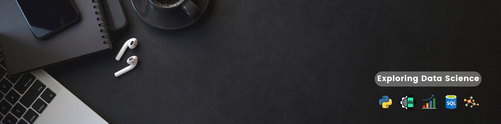

# **Hi there** 👋

## **✨About me:**

I’m a data professional with 2.5 years of experience, including 1.5 years leading a 30+ member Data Engineering team. I’m currently pursuing an MS in Information at the University of Wisconsin–Madison, building deeper expertise in Data Science, Machine Learning, NLP, analytics, and data management.

 

My professional experience has centered on working with data across extraction, transformation, pipeline development, analysis, and business problem-solving. Leading a data engineering team has also given me experience coordinating technical work, managing projects, and collaborating across teams to deliver data-driven solutions.

 

I’m now building on that industry foundation to transition deeper into Data Science and Machine Learning. My technical background includes Python, SQL, Pandas, NumPy, Tableau, and Advanced Excel, complemented by formal and self-directed training in mathematics, statistics, and machine learning.

 

At UW–Madison, I’m further developing this skill set through coursework in Machine Learning (STAT 451), NLP & Text Mining (LIS 501), Data Mining Planning and Management (LIS 706), Relational Database Design (LIS 751), and, Date Management (LSI 711), and Data Visualization (LIS 707).

Technical interests: Python | SQL | Machine Learning | NLP | Data Analytics | Data Engineering | Data Visualization

## **💻Skills:**

- Advance Excel
- SQL
- Python
- Machine Learning
- Tableau
- Data Analysis
- Business Analysis

## **📊GitHub Stats:**

